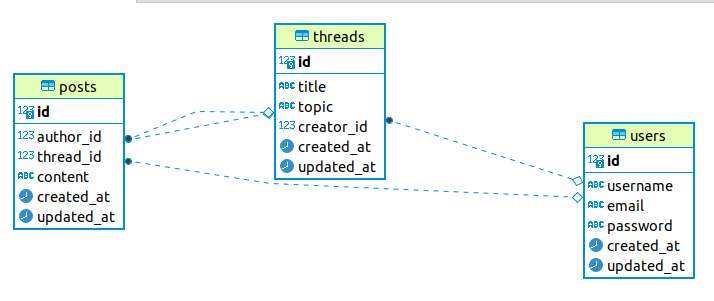

# Golang Forum API

## Description

-------
A simple API that already provide basic features of the forum web application and implemented in Golang language. This project is sample of production ready API that already has JWT auth system, logger, test, and also openAPI/swagger docs.

## Project Structure

-------
Here is summary general structure (folder and important files) in the project and It's short description, where structure separation itself is mainly based on It's context and functionality.
- **api**: Stuff that related to source code of the API itself
  - **auth**: Stuff that specifically related to auth system
  - **controllers**: Functions that handling request as the end/terminal handler, so function here is main judge to giving response of the request.
  - **database**: Stuff that related to interact with DB 
  - **logger**: Stuff that related to writing log of the API
  - **middlewares**: Functions that placed as an intermediate component that passed by the request and response
  - **models**: Structure that used as the DB table's schema representation in Go, and also being model for request-response format and It's corresponding casting function/method
  - **routers**: Function that define endpoint path and It's pipeline or route or function chain that become request-response way
  - **utils**: Helper function to help implement other functionalities faster, easier, and less redundant
  - ***server.go***: Go code that become gateway (startup) of the API 
- **docs**: Related to the documentation of the project, especially of the API
  - **assets**: Static file that being served as the content of the docs (such as images, etc)
  - **swaggerui**: Satic file that specifically for the file server of the swagger docs
- **logs**: Log file(s) of the API
- **migrations**: Go source code that needed to migrate model/schema to the DB
- **seeders**: Go source code that needed to seed/insert data/record to the DB
- ***main.go***: Go code that become gateway of the project application
- ***.env***: Environment variable that used to run this app
- ****.sh***: Shell console code that highly needed and packed to help operation of the project
  
<!-- ```
root
├── config
│   └── routes.js
├── screens
│   └── App
│       ├── screens
│       │   ├── Admin
│       │   │   ├── screens
│       │   │   │   ├── Reports
│       │   │   │   │   └── index.js
│       │   │   │   └── Users
│       │   │   │       └── index.js
│       │   │   └── index.js
│       │   └── Course
│       │       ├── screens
│       │       │   └── Assignments
│       │       │       └── index.js
│       │       └── index.js
│       └── index.js
└── index.js
``` -->

## Models

-------



Here is the details of model's schema that used in the DB 

1. **User** -> ***users***
   - ID: uint32 -> id: bigint (bigserial)
   - Username: string -> username: varchar(255) unique not null
   - Email: string -> email: varchar(255) unique not null
   - Password: string -> password: varchar(255) not null
   - CreatedAt: time.Time -> created_at: timestamp
   - UpdatedAt: time.Time -> updated_at: timestamp
2. **Thread** -> ***threads***
   - ID: uint64 -> id: bigint (bigserial)
   - Title: string -> title: varchar(255) not null
   - Topic: string -> topic: varchar(255) not null
   - CreatorID: uint32 -> creator_id: bigint
   - Creator: *User
   - Posts: []*Post
   - CreatedAt: time.Time -> created_at: timestamp
   - UpdatedAt: time.Time -> updated_at: timestamp
3. **Post** -> ***posts***
   - ID: serial, uint64
   - AuthorID: uint64 -> author_id: bigint
   - Author: *User
   - ThreadID: uint64 -> thread_id: bigint
   - Thread: *Thread
   - Content: string -> topic: teet not null
   - CreatedAt: time.Time -> created_at: timestamp
   - UpdatedAt: time.Time -> updated_at: timestamp

And the relations basically are

1. One-to-Many between **User** and **Thread**
   -> ***threads.creator_id*** referencing ***users.id***
2. One-to-Many between **User** and **Post**
   -> ***posts.author_id*** referencing ***users.id***
3. One-to-Many between **Thread** and **Thread**
   -> ***posts.thread_id*** referencing ***threads.id***

## API Endpoints

-------
More details of the API endpoint you could see in the swagger docs, but here are summary of the available endpoints:
1. **SwaggerUI Docs** in `/docs/` [get]
2. **User**
   - `/signin` [post] -> DTO reqBody: **Credentials**, resBody: **Claims**
   - `/signup` [post] -> DTO reqBody: **RegistrationRequest**
   - `/users` [get] -> queries: **maxid**, **minid**, **username**, **page**, **pagesize**, DTO resBody: (array of) **UserResponse**
   - `/users` [patch] -> DTO reqBody: : **UserUpdateRequest**
   - `/users/{id}` [get] -> DTO resBody: **UserResponse**
   - `/users/{id}` [delete] -> DTO resBody: **UserResponse**
3. **Thread**
   - `/threads` [get] -> queries: **title**, **topic**, **userid**, **username**, **page**, **pagesize**, DTO resBody: (array of) **Thread**
   - `/threads` [post] -> DTO reqBody: **ThreadCreateRequest**
   - `/threads` [patch] -> DTO reqBody: **ThreadUpdateRequest**
   - `/threads/{id}` [get] -> DTO resBody: **Thread**
   - `/threads/{id}` [delete] -> DTO resBody: **Thread**
4. ***Post***
   - `/posts` [get] -> queries: **content**, **userid**, **username**, **page**, **pagesize**, DTO resBody: (array of) **Post**
   - `/posts` [post] -> DTO reqBody: **PostCreateRequest**
   - `/posts` [patch] -> DTO reqBody: **PostUpdateRequest**
   - `/posts/{id}` [delete] -> -> DTO resBody: **Post**

Authentication schema used is by using Bearer token that specified in Authorization header and has format
```
   {Header Key}      {Header body}
   Authorization     Bearer <your_token>
   Authorization     Bearer <header>.<body>.<signature>
```

## Application Dependency

-------

1. [**Go**](https://golang.org/), here I'm using v1.13.
2. [**PostgreSQL**](https://www.postgresql.org/), and here I'm using v13.1.
3. **Linux OS** (optional), recommended using Ubuntu-based distros since I'm using [**Ubuntu 20.04**](https://ubuntu.com/).
4. [**Docker**](https://www.docker.com/) (optional), if you want to containerize the app and the db.
5. [**Postman**](https://www.postman.com/) (optional), to use or test the API with forging requests  directly, and could be used to open [postman_collection.json](docs/forum_api.postman_collection.json) that include request sample of every endpoints.
6. Browser (optional), such as [**Firefox**](https://www.mozilla.org/en-US/firefox/new/) or [**Chrome**](https://www.google.com/chrome/), which is needed to see swaggerui static file from the fileserver.

## Go Library/Module Used

-------

1. `gorm.io/gorm` as Object Relational Mapping (ORM) library that I used in this project to access database, and `gorm.io/driver/postgres` as the mandatory driver that ORM need to access Postgre DB.
2. `github.com/gorilla/mux` as routing helper, and `github.com/gorilla/context` as helper to passing data through the middleware.
3. `github.com/sirupsen/logrus` as main library to help logging the API and `github.com/rifflock/lfshook` as hook library to write file to the file.
4. `github.com/asaskevich/govalidator` as helper library to help validate input.
5. `github.com/mikunalpha/goas` as helper to make swagger spec from the comments in the source code.
6. `github.com/joho/godotenv` to help fetch environment var from a file.
7. `github.com/dgrijalva/jwt-go` library that needed to make JWT-based auth.
8. `github.com/go-errors/errors` helps to checking or handling things that related to error type.


## How to Install 

-------
For run the API for the first time, make sure to do these steps:

1. Prepare application that needed, minimum Go and PostgreSQL. You could use dockerized version API from create the docker image with the `Dockerfile`, and also create PostgreSQL instance in docker container with command in `init_db.sh`, or simply you could just run in terminal
   ```
      sh init_db.sh
   ```
   Or you could use this command directly to be executed
   ```
      sudo docker pull postgres
      sudo docker container run -d --name=pg-forum -p 5400:5432 -e POSTGRES_PASSWORD=postgres -e PGDATA=/pgdata_docker -v /pgdata_docker:/pgdata_docker postgres # This will map port 5400 host to postgres port (5432)
      PGPASSWORD='postgres' psql -h localhost -p 5400 -U postgres -c "create database forum_db"
   ```
2. Install every Go library listed in `go.mod` with below command
   ```
      go mod tidy
   ```
   or from `glide.yaml` file if you're using and familiar with glide.
3. Set the environment variable in the `.env` file to the value that approriate.
4. Migrate the models to the DB and try to seed the data if you think It's needed.

## How to Run

-------
Running the application is just run the `main.go` in the root of the project based on main function of the app that you want to use

1. **API**
   ```
      go run main.go
   ```
2. **Migrate Models**
   ```
      go run main.go -- migrate
   ```
3. **Seed Data**
   ```
      go run main.go -- seed
   ```

Or you could try to build the projct first and then try to execute it with corresponding schema that written above. For example you could run this command below
```
   go build -o main
   ./main   # or ./main -- test or ./main -- migrate
```

## How to Test

-------
To test the application just run code in the `run_tests.sh`, or simply you could just run in terminal
```
   sh run_tests.sh
```
Or you could try to execute the command manually
```
   go run main.go -- seed
   go test -v ./api/controllers/post_test.go
   go test -v ./api/controllers/thread_test.go
   go test -v ./api/controllers/user_test.go
   go run main.go -- seed  # or go run main.go -- migrate
```
In case you add other test and want to run them all you could execute this instead
```
   go run main.go -- seed
   go test -v ./... -count 1 -p 1 # The flag is used to make the test run single-threadedly
   go run main.go -- seed  # or go run main.go -- migrate
```
And see if there is any fail on it.

## Issues

-------

1. Still can't log GORM query into a file.
2. Log message into terminal still has bad format (spacing).